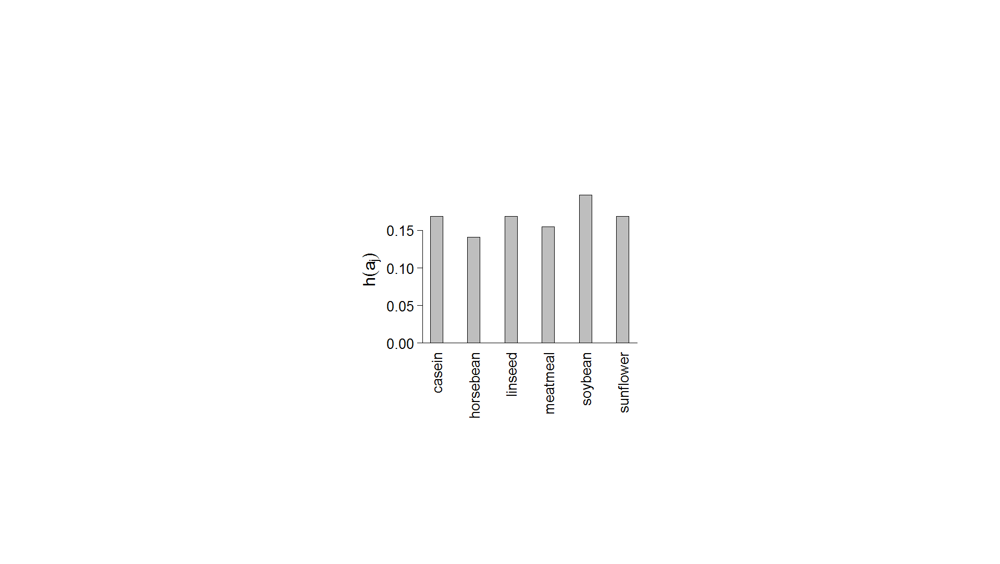
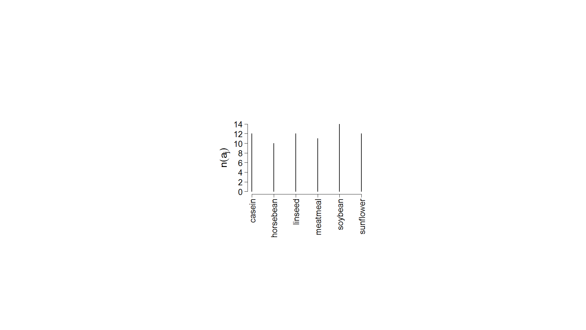

[](http://quantlet.de/)

## [](http://quantlet.de/) **BCS_BarGraphs** [](http://quantlet.de/)

```yaml

Name of Quantlet : BCS_BarGraphs

Published in : Basic Elements of Computational Statistics

Description : 'Bar diagram and plot of relative frequencies of the R data subset "chickwts$feed".
It is an efficient way of plotting the frequencies of discreet variables, particularly useful to
illustrate the behaviour (variation) over time.'

Keywords : data visualization, distribution, graphical representation, plot, visualization

See also : BCS_BarGraphs, BCS_Boxplot, BCS_Boxplot2, BCS_ecdf, BCS_hist1, BCS_hist2

Author[New] : Gunawan

Submitted : 2016-01-28, Christoph Schult

Output : Bar diagram and plot of chickwts in .pdf format.

```






### R Code:
```r
# cex for axis label size, margins (bottom, left, top, right) fin for figure dimension region (width and height), mgp
# for the positions of axis las for label axis style = 2 (always perpendicular to the axis)
par(cex.axis = 1.7, mai = c(b = 0.5, l = 1.2, t = 0.01, r = 0.01), fin = c(w = 5.5, h = 3.5), mgp = c(4, 0.8, 0), las = 2)

# Bar Plot with axis label size=2, space between bars equal 2
barplot(table(chickwts$feed)/length(chickwts$feed), space = 2, ylab = expression(h(a[j])), xlab = "", cex.lab = 2)
abline(h = 0)

# cex for axis label size, margins (bottom, left, top, right) fin for figure dimension region (width and height), mgp
# for the positions of axis las for label axis style = 2 (always perpendicular to the axis)
par(cex.axis = 1.7, mai = c(b = 0.5, l = 0.95, t = 0.01, r = 0.01), fin = c(w = 5, h = 3), mgp = c(2.8, 0.8, 0), las = 2)

# Bar Diagram with axis label size=2
plot(table(chickwts$feed), ylab = expression(h(a[j])), xlab = "", cex.lab = 2)

```
