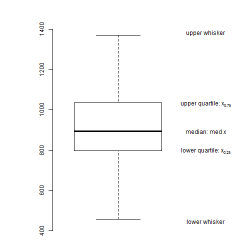

[](http://quantlet.de/)

## [](http://quantlet.de/) **BCS_Boxplot2** [](http://quantlet.de/)

```yaml

Name of Quantlet : BCS_Boxplot2

Published in : Basic Elements of Computational Statistics

Description : 'Boxplot of R example dataset Nile and manual calculation and notation of important
values. The notation on the axes is calculated manually, giving a nice example of the calcuation of
a five number summary, on which the box-plot is based. Note that R by default draws the whiskers to
the highest/lowest value in the sample which is still in the upper-/lower fence.'

Keywords : boxplot, Nile, data visualization, outlier detection, histogram

Author[New] : Gunawan

Submitted : 2016-01-28, Christoph Schult

Output : Boxplot of Nile in .pdf format

```




### R Code:
```r
# margins (bottom, left, top, right)
par(mai = c(b = 0.01, l = 1e-04, t = 0.01, r = 0.1))
# Box-plot located at x=0.8 without frame, with default 1.5 range and outliers
boxplot(Nile, at = 0.8, frame = F, range = 1.5, outline = T, yaxt = "n", ylim = c(400, 1500))

# Add a y axis
axis(2, pos = 0.5, col.axis = "black", las = 0)

# compute the quartiles and lower&upper fence
lowq = quantile(Nile, probs = 0.25)
median = quantile(Nile, probs = 0.5)
uppq = quantile(Nile, probs = 0.75)
lowerfence = lowq - 1.5 * (diff(quantile(Nile, probs = c(0.25, 0.75))))
upperfence = uppq + 1.5 * (diff(quantile(Nile, probs = c(0.25, 0.75))))
# Compute the endpoint of each whisker, e.g. the max/min value still within the upper/lower-fence
lowerwhisker = min(Nile[Nile > lowerfence])
upperwhisker = max(Nile[Nile < upperfence])

# write description in the Box-Plot
text(1.2, lowq, expression("lower quartile: x"[0.25]), font = 2)
text(1.2, median, expression("median: med x"), font = 2)
text(1.2, uppq, expression("upper quartile: x"[0.75]), font = 2)
text(1.2, upperfence, "upper whisker", font = 1)
text(1.2, lowerfence, "lower whisker", font = 1)
```
