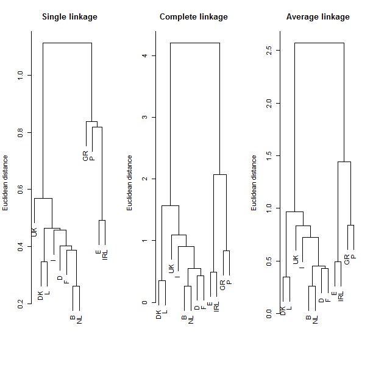

[](http://quantlet.de/)

## [](http://quantlet.de/) **BCS_CAmethods** [](http://quantlet.de/)

```yaml

Name of Quantlet : BCS_CAmethods

Published in : Basic Elements of Computational Statistics

Description : 'Perform a cluster analysis using single, complete and average linkage algorithms on
the data set "agriculture" from the package "cluster". The three resulting dendrograms are plotted
to show the divergence in the results.'

Keywords : plot, cluster, analysis, average linkage, dendrograms

Author[New] : Anastasija Tetereva

Submitted : 2016-01-28, Christoph Schult

Output : Combined plot of three dendrograms of different clustering methods

```




### R Code:
```r

library("cluster")  # install package for cluster analysis
data("agriculture", package = "cluster")  # load the data
mydata = scale(agriculture)  # normalize the data
d = dist(mydata, method = "euclidean")  # calculate distance matrix
print(d, digits = 2)  # show distance matrix

dev.new()
par(mfrow = c(1, 3))  # draw 3 differents methods in one plot
plot(hclust(d, method = "single"), main = "Single linkage", sub = "", xlab = "", ylab = "Euclidean distance")
plot(hclust(d, method = "complete"), main = "Complete linkage", sub = "", xlab = "", ylab = "Euclidean distance")
plot(hclust(d, method = "average"), main = "Average linkage", sub = "", xlab = "", ylab = "Euclidean distance")
```
