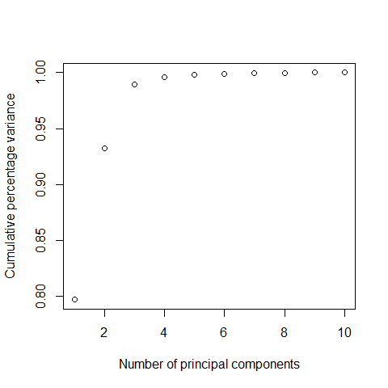

[](http://quantlet.de/)

## [](http://quantlet.de/) **BCS_FAsummary** [](http://quantlet.de/)

```yaml

Name of Quantlet : BCS_FAsummary

Published in : Basic Elements of Computational Statistics

Description : 'Performs a factor analysis on a subset of the data "decathlon" from package
"FactoMineR" for three factors. The result is depicted in a correlation plot.'

Keywords : factor, analysis, plot, decathlon, FactoMineR, plot

Author : Anastasija Tetereva

Submitted : 2016-01-28, Christoph Schult

Output : A scatterplot showing the relationship between principal components and actual data.

```




### R Code:
```r
require(FactoMineR)
data("decathlon", package = "FactoMineR")
mydata = decathlon[, 1:10]  # choose relevant variables
fit = princomp(mydata)  # perform PCA
# plot cum. percentage of var. explained by number of components
plot(cumsum(fit$sdev^2/sum(fit$sdev^2)), xlab = "Number of principal components", ylab = "Cumulative percentage variance")
```
