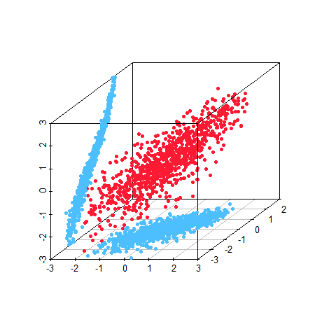

[](http://quantlet.de/)

## [](http://quantlet.de/) **BCS_HAC** [](http://quantlet.de/)

```yaml

Name of Quantlet : BCS_HAC

Published in : Basic Elements of Computational Statistics

Description : 'The HAC package is used to create a random sample. The distribution is created
iteratively. First the bivariate marginal distribution is created for the variables, which have a
higher correlation. In the second step the bivariate marginal distribution is stacked together with
the remaining variable. The actual observations are obtained, by using the quantile function of the
respective marginal distribution. The trivariate distribution is plotted in a three dimensional
scatterplot with its bivariate marginal distributions.'

Keywords : 'multivariate, copula, archimedean, uniform, gumbel, HAC, normal, student, distribution,
pdf, cdf'

Author : Ostap Okhrin

Submitted : 2016-01-28, Christoph Schult

Output : A 3d scatterplot for an HAC object with normally and t distributed margins.

```




### R Code:
```r
graphics.off()
library(copula)
library(HAC)
library(scatterplot3d)

# HAC for a better understanding see ?hac() or the documentation of HAC
HAC = hac(type = 1, tree = list(list("X1", "X2", 10), "X3", 2))  # defines the structure of the object
x = rHAC(1000, HAC)  # only produces random distributions in [0,1] interval
# transform estimated random probabilities to observations
Y = cbind(qnorm(x[, 1]), qt(x[, 2], 2), qnorm(x[, 3]))

# filter outliers
L = (Y >= -3) & (Y <= 3)  # logical variable (true for values in the interval)
Y = Y[L[, 1] & L[, 2] & L[, 3], ]  # remove outliers

# marginal distribution of y1 and y2
Y12 = cbind(rep(-3, length(Y)), Y[, 1], Y[, 2])
# marginal distribution of y1 and y3
Y13 = cbind(Y[, 1], rep(-3, length(Y)), Y[, 3])
# marginal distribution of y2 and y3
Y23 = cbind(Y[, 1], Y[, 3], rep(-3, length(Y)))

# plots the trivariate distribution
graph = scatterplot3d(Y, xlim = c(-3, 3), ylim = c(-3, 3), zlim = c(-3, 3), pch = 20, color = rgb(1, 0.1, 0.2), xlab = "", 
    ylab = "", zlab = "")  # no labels for the axes

# plots the bivariate distribution of y1 and y2
graph$points3d(Y12, pch = 20, col = rgb(0.3, 0.75, 1))

# plots the bivariate distribution of y2 and y3
graph$points3d(Y23, pch = 20, col = rgb(0.3, 0.75, 1))

```
