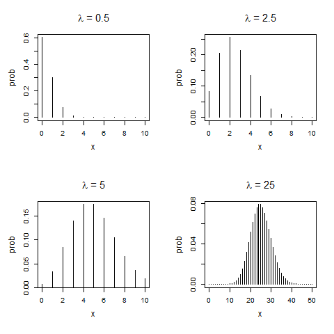

[](http://quantlet.de/)

## [](http://quantlet.de/) **BCS_Poispdf** [](http://quantlet.de/)

```yaml

Name of Quantlet : BCS_Poispdf

Published in : Basic Elements of Computational Statistics

Description : 'Plots the probability mass distribution of the Poisson distribution for different
values of the shape parameter lambda. It can be seen that the poisson distribution approaches the
normal distribution for higher lambda.'

Keywords : distribution, normal approximation, plot, poisson, visualization

See also : BCS_Binompdf, BCS_Binpois, BCS_ChiPdf, BCS_NormPdfCdf, BCS_tPdfCdf

Author[New] : Johannes Haupt

Submitted : 2016-01-28, Christoph Schult

```




### R Code:
```r
# setting up the axis label size and margin (bottom, left, top, right)
par(cex.lab = 1.2, cex.main = 1.6, mar = c(5.5, 4.5, 4, 2) + 0.1, mgp = c(2.7, 1, 0), mfrow = c(2, 2), cex.main = (1.5))

# Plot the Poisson distribution for sample size 10 and different lambdas
n = 10
x = 0:n
lambda = 0.5

prob = dpois(x, lambda)
plot(x, prob, type = "h", main = expression(paste(lambda, " = 0.5")))

# 2nd plot
n = 10
x = 0:n
lambda = 2.5

prob = dpois(x, lambda)
plot(x, prob, type = "h", main = expression(paste(lambda, " = 2.5")))

# 3rd plot
n = 10
x = 0:n
lambda = 5

prob = dpois(x, lambda)
plot(x, prob, type = "h", main = expression(paste(lambda, " = 5")))

# 4th: Plot the Poisson distribution for sample size 50
n = 50
x = 0:n
lambda = 25

prob = dpois(x, lambda)
plot(x, prob, type = "h", main = expression(paste(lambda, " = 25")))
```
