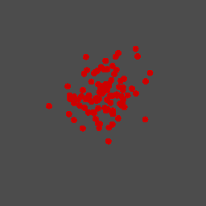
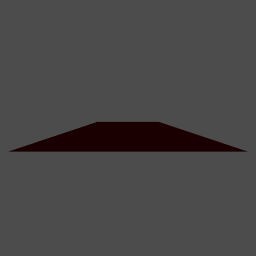

[](http://quantlet.de/)

## [](http://quantlet.de/) **BCS_Shapes** [](http://quantlet.de/)

```yaml

Name of Quantlet : BCS_Shapes

Published in : Basic Elements of Computational Statistics

Description : 'This code shows how to create different shapes with random numbers in R. Six
different objects are created with six different functions. Each function uses variables as
coordinates for the shapes created.'

Keywords : 'points, lines, linestrips, triangles, plot, quads, spheres, random, normal, random
numbers, 3D, trellis, lattice, rgl'

Author : Polina Marchenko

Submitted : 2016-01-28, Christoph Schult

Output : Six plots for random variables creating specific geometric shapes.

```







### R Code:
```r
# make sure the package is installed install.packages('lattice') install.packages('rgl')
library(lattice)
library(rgl)
graphics.off()

# Points

Points = rgl.points(rnorm(100), rnorm(100), rnorm(100), col = "red3", size = 8)

# Lines

Lines = rgl.lines(x = rnorm(100), y = rnorm(100), z = rnorm(100), col = "red3")


# Linestripes

Linestrips = rgl.linestrips(x = rnorm(100), y = rnorm(100), z = rnorm(100), col = "red3")

# Triangles

M = matrix(rnorm(99), 3, 33)
Triangles = triangles3d(M, col = "grey", alpha = 1, color = "red3")
aspect3d(1, 1, 1)

# Quads

xlims = rnorm(100)
ylims = rnorm(100)
zlims = rnorm(100)
Quads = rgl.quads(xlims[c(1, 2, 2, 1)], zlims[c(2, 2, 1, 1)], ylims[c(1, 1, 2, 2)], color = "red3")
aspect3d(1, 1, 1)

# Spheres

Spheres = rgl.spheres(x = 1, y = 3, z = 3, radius = 1, col = "red3", smooth = T)

```
