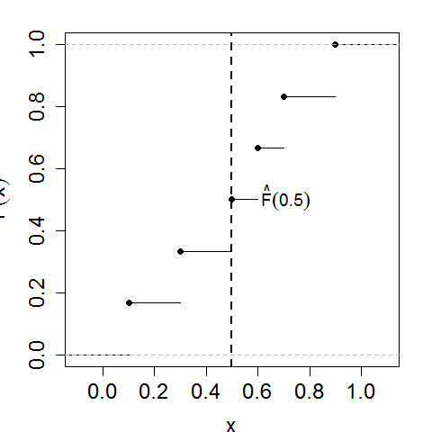

[](http://quantlet.de/)

## [](http://quantlet.de/) **BCS_ecdf** [](http://quantlet.de/)

```yaml

Name of Quantlet : BCS_ecdf

Published in : Basic Elements of Computational Statistics

Description : 'Plot of the Empirical Cumulative Distribution Function of the R example dataset
Formaldehyde, specifically Formaldehyde$car.'

Keywords : empirical, cdf, distribution, visualization, plot

See also : BCS_BarGraphs, BCS_pie, BCS_hist1, BCS_hist2, BCS_Boxplot2

Author[New] : Gunawan

Submitted : 2016-01-28, Christoph Schult

Output : Plot of ECDF of Formaldehyde in .pdf format.

```




### R Code:
```r
# ecdf of Formaldehyde$car is a step function
ecdf(Formaldehyde$car)

d = ecdf(Formaldehyde$car)

# axis label setup & margins (bottom, top, left, right)
par(cex.lab = 1.5, mai = c(b = 1, l = 1, t = 0.5, r = 0.5))

# plot ECDF
plot(d, ylab = expression(hat(F)(x)), xlab = "x", main = "")

# Vertical line at Fhat(0.5)
abline(v = 0.5, lty = 2, lwd = 2)
text(0.71, 0.51, expression(hat(F)(0.5)), cex = 1.2)
```
